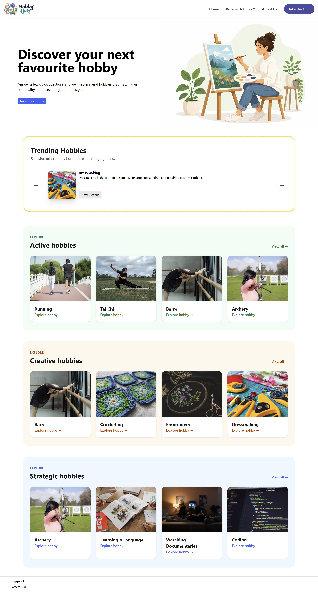
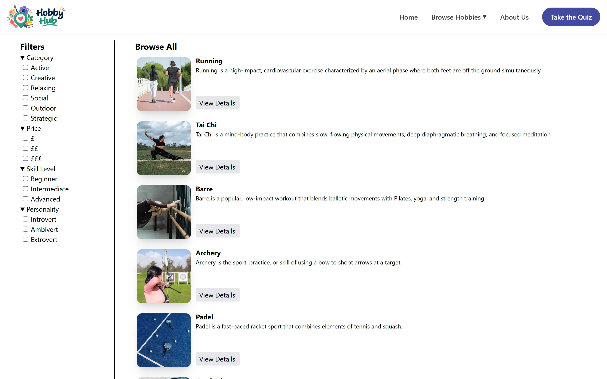
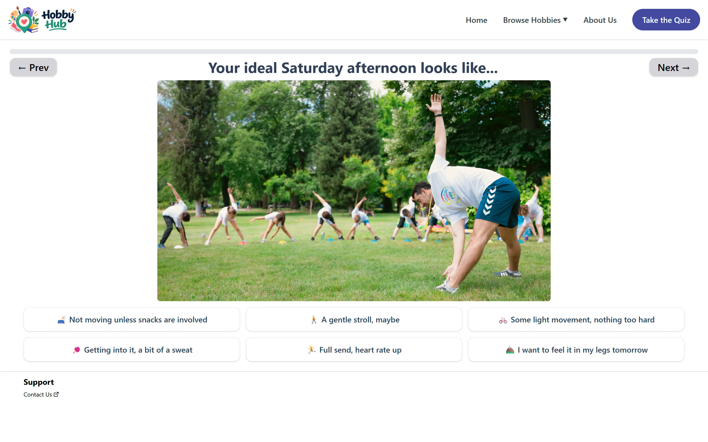
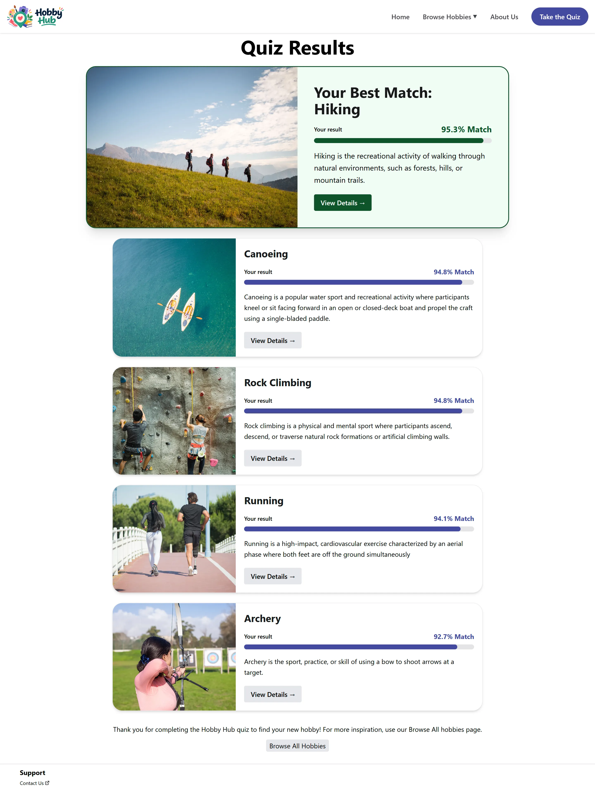

# Hobby-Hub

Hobby Hub is a full-stack hobby discovery platform built collaboratively using C#, ASP.NET Core, React, TypeScript, and Tailwind CSS.  
Users can browse hobbies, filter by category, price, skill level and personality, and complete a short quiz that recommends hobbies matched to their interests and preferences.  
Each hobby includes a beginner-friendly YouTube guide, helping users get started quickly and confidently.  
The platform also features weekly trending hobbies generated through deterministic randomisation, ensuring fresh inspiration every week.

**Live site:** https://cjm-projects.github.io/Hobby-Hub/



# Features

- **Personalised Quiz** Eight questions about your interests, budget and free time. The API compares your answers with each hobby's scores using cosine similarity and returns your top 5 matches, each with a match percentage.
- **Browse All Hobbies** All 37 hobbies in one place, with filters for category, price, skill level and personality.
- **Category Pages** Active, Creative, Relaxing, Social, Outdoor and Strategic each have their own page.
- **Beginner YouTube Guides** A beginner video is embedded directly into each hobby page.
- **Weekly Trending Hobbies** Three hobbies are picked using the current week number as the random seed, so everyone sees the same picks all week and new ones the next.
- **Accessible UI** Following WCAG principles.
- **Responsive Frontend** Built with React + Tailwind CSS.
- **RESTful API** Built with ASP.NET Core Web API.
- **Strongly Typed Frontend** TypeScript models match the data returned by the API.
- **Error Handling** A global middleware catches unhandled exceptions and returns a JSON error response.
- **Health Check** `/health` reports the API status and how many hobbies are available.
- **Cloud Hosting** The frontend is hosted on GitHub Pages, and the API runs on AWS EC2 as a systemd service behind an Nginx reverse proxy with HTTPS.
- **GitHub Pages Friendly Routing** Production builds use the `/Hobby-Hub/` base path, and `HashRouter` keeps page links working without any server configuration.
- **Restricted CORS** The API only accepts requests from the frontend, with separate allowed addresses for development and production.

# Full-Stack Tech Summary

| Layer          | Technologies                                                              |
| -------------- | ------------------------------------------------------------------------- |
| **Frontend**   | React 19, TypeScript, Tailwind CSS v4, React Router, React Compiler, Vite |
| **Backend**    | C#, ASP.NET Core Web API (.NET 10)                                        |
| **Data**       | JSON file storage                                                         |
| **Testing**    | NUnit, Moq                                                                |
| **Deployment** | GitHub Pages, AWS EC2 (Ubuntu), Nginx, systemd                            |
| **Tools**      | Figma, Jira, ESLint, gh-pages                                             |

# Screenshots

Browse All:



Hobby details:


Quiz:



Quiz results:



# Project Structure

```
Hobby-Hub/
├── Hobby-hub/                ASP.NET Core Web API
│   ├── Controllers/          Hobby and Quiz endpoints
│   ├── Services/             business logic, including quiz matching
│   ├── Repositories/         reads hobbies from the JSON file
│   ├── Data/                 hobby-data.json
│   ├── Data Models/          hobby, score, quiz and category models
│   ├── Middlewares/          global exception handling
│   └── Health Check/         check used by /health
├── Hobby-Hub-Testing/        NUnit tests for the API
├── hobby-hub-frontend/       React and TypeScript frontend
│   └── src/
│       ├── pages/            one component per route
│       ├── components/       shared UI components
│       └── models/           TypeScript types for API data
└── Hobby-hub.slnx            solution file
```

# API Endpoints

All endpoints are `GET` requests.

| Endpoint                     | Description                                                                                 |
| ---------------------------- | ------------------------------------------------------------------------------------------- |
| `/hobby`                     | All hobbies                                                                                 |
| `/hobby/{hobbyName}`         | A single hobby by name, or 404 if it does not exist                                         |
| `/hobby/trending`            | Three trending hobbies for the current week                                                 |
| `/hobby/category/{category}` | Hobbies in a category: `Active`, `Creative`, `Relaxing`, `Social`, `Outdoor` or `Strategic` |
| `/quiz/results`              | Top 5 hobby matches for the quiz answers given as query parameters                          |
| `/health`                    | API status and number of hobbies available                                                  |

`/quiz/results` takes `active`, `creative`, `relaxing`, `social`, `outdoor` and `strategic` scores.  
`price` and `timeCommitment` are optional. When set between 1 and 5, hobbies above that level are left out.

# Running Hobby Hub Locally

Hobby Hub contains both the ASP.NET Core API and the React and TypeScript frontend inside the same repository.
To run the project locally, start both parts side-by-side.

## Prerequisites

- .NET 10 SDK
- Node.js 20.19+ or 22.12+
- Visual Studio with .NET 10 support (optional, you can use the .NET CLI instead)

## 1. Start the Backend

Open `Hobby-hub.slnx` in Visual Studio and press the green Run button, or in a terminal:

```bash
cd Hobby-hub
dotnet run
```

This will start the API at: http://localhost:5000.

## 2. Start the Frontend

In a second terminal:

```bash
cd hobby-hub-frontend
npm install
npm run dev
```

This will start the frontend at: http://localhost:5173.

The frontend reads the API address from `.env.development` when running locally and `.env.production` for the live site. In development, the API only accepts requests from `http://localhost:5173`.

## 3. Using the App

Once both servers are running:

- Visit http://localhost:5173 on a web browser to use the app.

# Testing

The backend uses NUnit and Moq for testing across the controller, service and repository layers.

Run all tests from the root of the repository:

```bash
dotnet test
```
